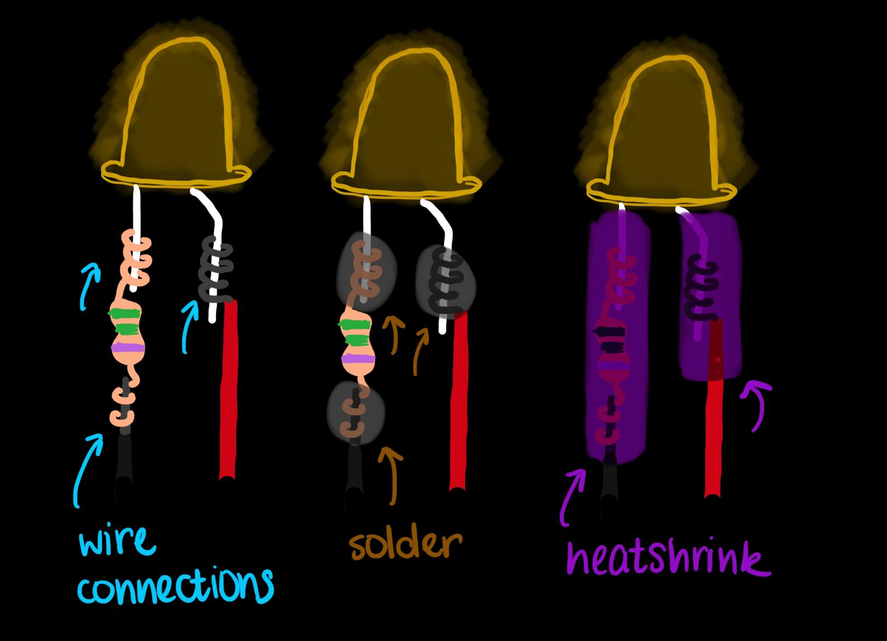
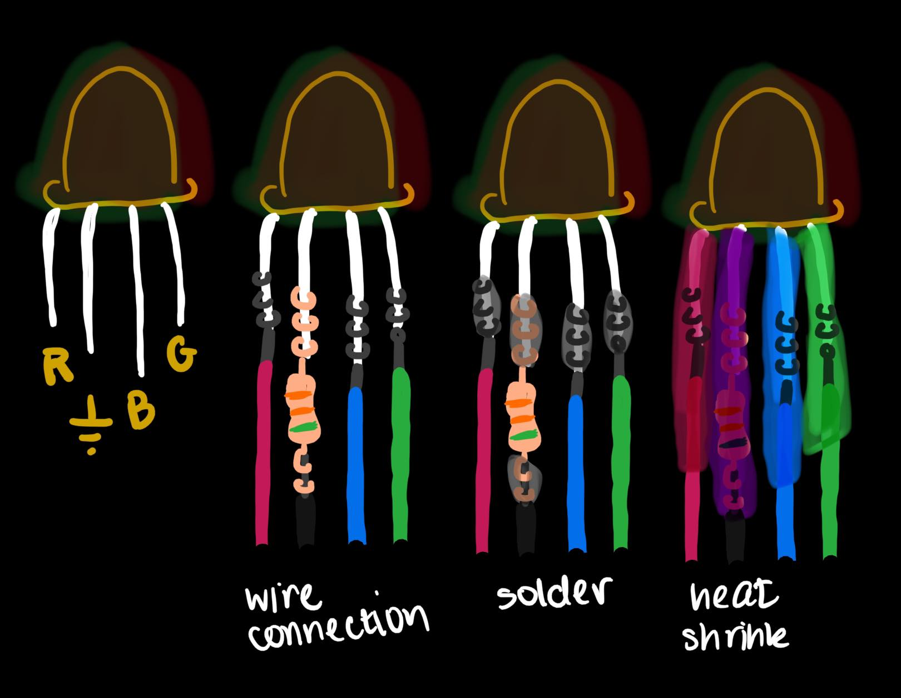
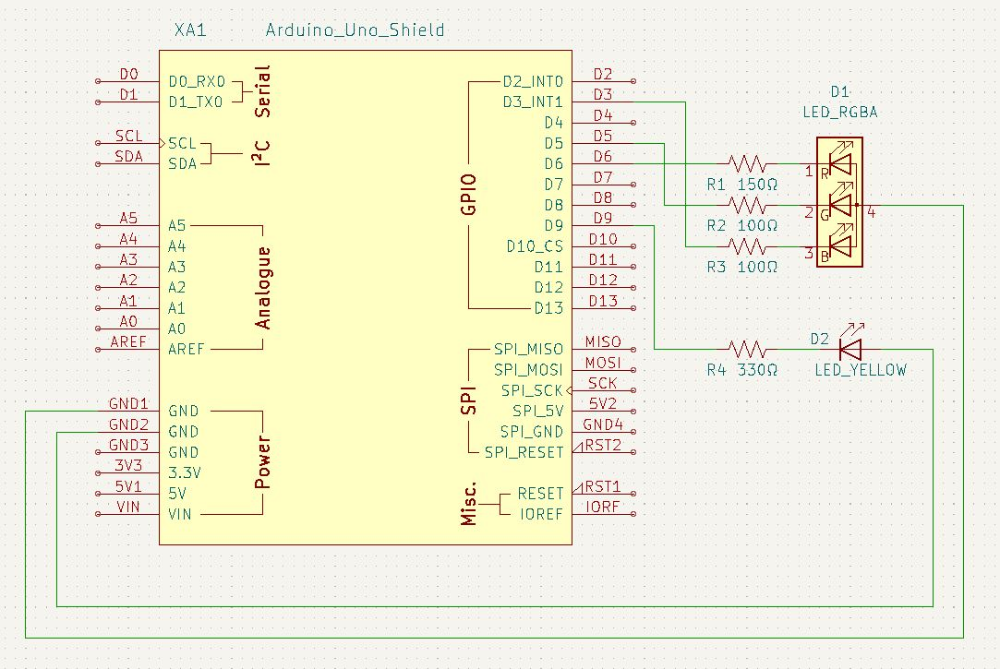

# Instructions for Electronics

## Supplies
### Materials:
- Arduino Leonardo
- Arduino Prototyping Shield
- 10 mm RGB LED
- 10 mm yellow LED
- 330 Ω resistor
- 270 Ω resistor
- 150 Ω resistor
- two 100 Ω resistors
- Heat shrink
- Solid core 22 or 24 gauge wire in black, red, and 3 other assorted colors

### Tools
- Soldering iron + accessories (solder, tip cleaning wire sponge, etc)
- Clip of some sort to hold electronics in place while soldering
- Wire strippers
- Wire snippers
- Heat gun for the heat shrink

## Instructions

Beginning by prepping the wire that you will need. You will need:
- Two 4-inch pieces of black wire
- One 4-inch piece of each red and three other colors
In total, you should have 6 pieces of cut wire.

If you're unfamiliar with the process of soldering, take a second to review [these instructions](https://lab64.stanford.edu/basic-soldering), courtesy of Stanford's lab64 makerspace.

First, we will prep the prototyping shield. Note that the diagram of the arduino shield shown in the schematic is for an Uno shield; we are using the Leonardo.  From reading on the web, it appears that the shields are basically compatible but that some Uno shields don't physically fit the Leonardo.  The shield in the PartsList.xlxs file does work with our Leonardos. It has labels that match up with those in the UNO diagram, but the physical locations aren't the same as the diagram shown in the instructions.  The two images ShieldFront.jpg and ShieldBack.jpg show pictures of the assembled shield we are using.

Snip the male-to-male headers into four pieces to match the width of the four block of female headers on the Arduino Leonardo. Then, solder the headers into the prototyping shield such that it matches the Leonardo and can be used as a shield for the Leonardo. If you are struggling to ensure they line up perfectly, stick the male-to-male headers into the Leonardo's female headers, and wiggle the prototyping shield so that the holes align with the male headers that are sticking up. Then, mark those spots, take the setup apart, and proceed to solder the male-to-male headers into the marked locations.

Once the prototyping shield is prepped, we can move to the LEDs. 

Begin with the yellow LED. Note that the positive leg of the LED is longer.  Solder a red wire to the positive leg and a black wire to a 330 Ω resistor to the negative leg, as shown below. Once finished, make sure to push heatshrink over each of the exposed wires/resistor, up to the bottom of the LED, and use the heat gun to attach it. See the picture below for more detail.

Next, do the same with the RGB LED. Use the 150 Ω resistor for the red leg of the LED and a 100 Ω for each of the green and blue legs. Solder those resistors to three wires of different colors. Attach the black wire to the negative leg. Just like before, use heatshrink over the open connections. Use the picture below as a reference.

Finally, you need to solder the LEDs to the Arduino shield. How this happens will depend on the specifics of the Arduino shield you use, but the following must be true:

For the RGB LED, the red leg must connect to D6, the green leg to D5, and the blue leg to D3. The negative leg needs to connect to ground. For the yellow LED, the positive leg must connect to D9, and the negative leg needs to connect to ground. See this schematic for specifics.

